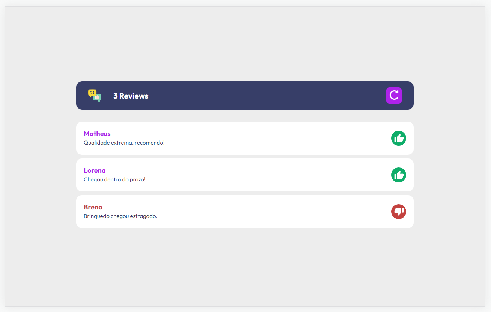
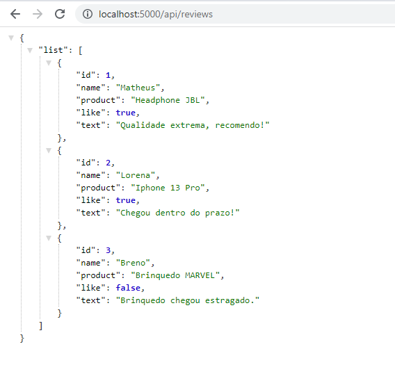
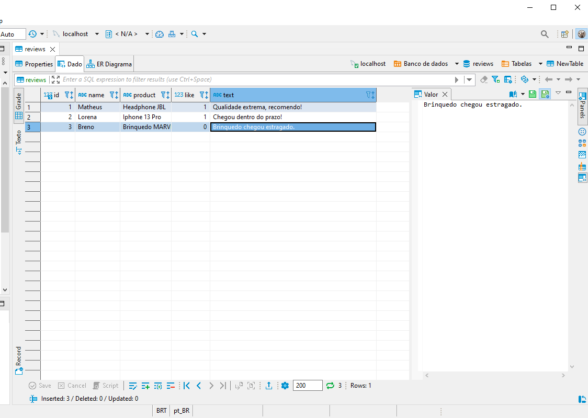

# REACTJS-REVIEWS 
Leitor de Reviews de Produtos com back-end local em MySql

<b>Banco de dados</b>: MySQL 
<b>Cliente</b>: DBeaver 22.2.0 

Rotas:
GET <b>/api/reviews</b> - Retorna todos os reviews inseridos na db. 

### Imagens

### Instação
- `npm install`

### Para rodar
- `npm start`
